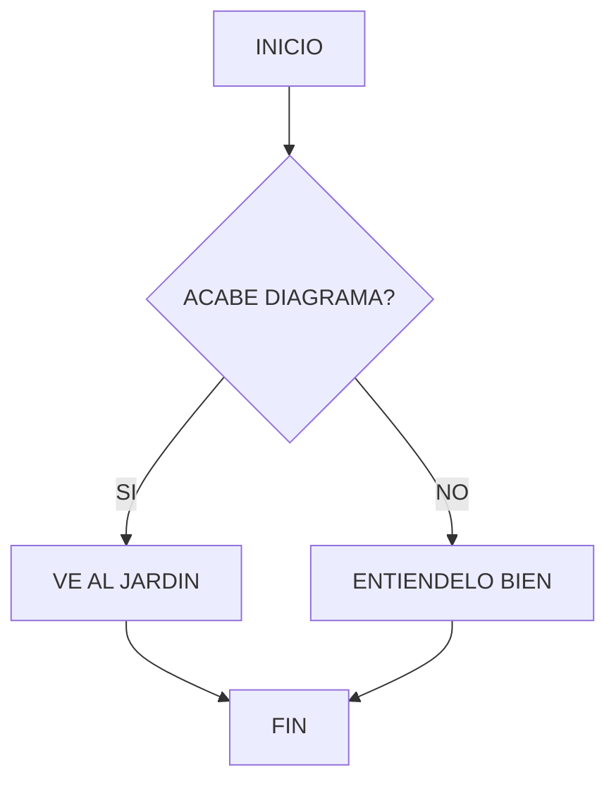

---
Area:
tema:
tags:
  - "#informatica"
  - "#Markdown"
  - "#lenguaje"
fecha: 2026-04-08
---
## DIAGRAMAS EN MD

Los diagramas en Markdown permiten representar visualmente ideas, procesos, sistemas y estructuras directamente dentro de tus notas. Son una herramienta poderosa para estudiar, planificar proyectos y entender conceptos complejos sin salir de tu editor (como Obsidian).

---

# 🧠 ¿POR QUÉ USAR DIAGRAMAS?

- Visualizas información compleja fácilmente
- Mejoras la memoria y comprensión
- Organizas ideas y procesos
- Documentas proyectos de forma profesional
- Ahorras tiempo (menos texto, más claridad)

---

# ⚙️ ¿CÓMO FUNCIONAN?

Markdown por sí solo no soporta diagramas, pero herramientas como **Mermaid** permiten integrarlos usando bloques de código.

En Obsidian, solo necesitas escribir:

```MARKDOWN
\`mermaid
graph TD
A[Inicio] --> B[Proceso]
B --> C[Fin]
```

OTRO EJEMPLO


flowchart TD
A[Inicio] --> B{¿Condición?}
B -- Sí --> C[Acción 1]
B -- No --> D[Acción 2]
C --> E[Fin]
D --> E

usare el siguiente codigo para este diagrama:
pero debe ser mermaid para que renderize bien el diegrama y no javascript 

```javascript
flowchart TD
A[INICIO] --> B{ACABE DIAGRAMA?}
B-- SI --> C[VE AL JARDIN]
B-- NO --> D[ENTIENDELO BIEN]
C-->E[FIN]
D-->E[FIN]
```



